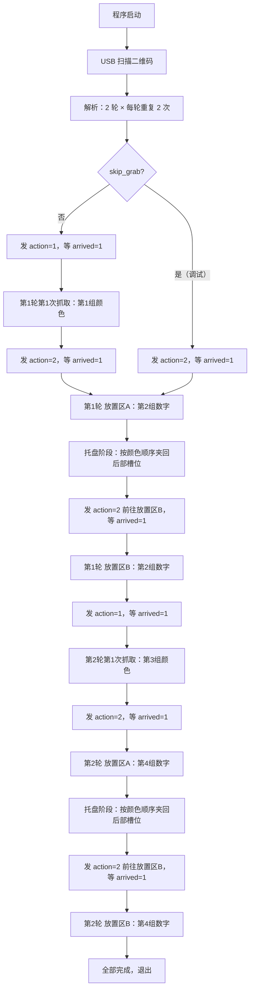
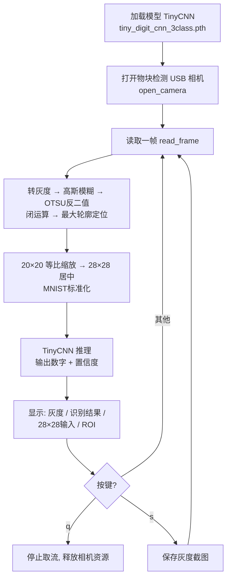

# 物块识别追踪系统（RoboMaster 视觉）

基于双 USB 免驱摄像头 + 颜色轮廓检测 + 卡尔曼滤波 + 博弈拦截规划的闭环对准系统。
仓库同时包含手写数字识别、HSV 调参工具、QR 码工具，以及旧版整机程序（遗留参考）。

---

## 项目概览

| 模块 | 入口 | 说明 |
|---|---|---|
| 物块识别追踪（主系统） | `src.py` | QR 扫序列 → USB 相机逐色检测 → KF 滤波 → 拦截规划 → 串口闭环对准 |
| 坐标/夹爪决策 | `transformer.py` | 相机坐标→世界坐标，按夹爪最远/最近距离决策底盘和夹爪动作 |
| 相机标定 | `calibrate_camera.py` | 棋盘格采集 + 内参标定，输出 `camera_calibration.json` |
| px_per_mm 标定 | `calibrate_px_per_mm.py` | 标尺法测量下位机 mm → 图像 px 的换算倍率 |
| 坐标换算验证 | `validate_transform.py` | 点击物块计算底盘/夹爪指令，并与实测距离对比 |
| 手写数字识别 | `felling_number.py` | USB 实时取流 + 轻量 CNN（MNIST）识别数字 |
| HSV 调参工具 | `hsv_tuner.py` | Trackbar 实时调节 6 色 HSV 阈值 |
| QR 工具 | `create_qr.py` | 生成测试二维码（如 `156+123+516+231`） |
| 外接屏显示 | `qr_display.py` | 把扫码结果大字显示在外接显示器上（监视状态文件） |
| 旧版整机程序 | `example_code.py` | 旧架构整机代码（含多种定标流程），仅作参考 |

---

## 目录结构

```
├── src.py                    # 主程序：QR → 物块识别追踪闭环
├── felling_number.py         # 手写数字识别（USB 实时 + TinyCNN）
├── model.py                  # TinyDigitCNN 模型定义（<25K 参数）
├── tiny_digit_cnn_3class.pth # 数字识别训练权重（3分类：1~3）
├── hsv_tuner.py              # HSV 阈值实时调参工具
├── example_code.py           # 旧版整机程序（含物块/色环/码垛定标，遗留）
├── common_camera.py          # 双 USB 摄像头统一配置与打开
├── camera_setup.py           # 摄像头角色配置工具（一次指定扫码/物块检测相机）
├── preprocessing.py          # 图像预处理（Otsu 二值化）
├── scan_QRcode_andlist.py    # QR 码扫描与目标序列解析
├── qr_display.py             # 外接屏幕大字显示扫码结果（独立运行）
├── felling_color.py          # 物块颜色检测器（HSV 阈值 + 轮廓 + 稳定性判定）
├── config.yaml               # 颜色阈值 / 形态学 / 稳定性 / 单位换算等统一参数（YAML）
├── kalman_tracker.py         # 6 维卡尔曼滤波（状态估计）
├── intercept_planner.py      # 拦截点博弈规划器（小车动力学）
├── transformer.py            # 相机→世界坐标变换 + 底盘/夹爪协同决策
├── calibrate_camera.py       # 棋盘格相机内参标定
├── gimbal.py                 # 串口通信（发送 + 底盘接收 + 时间戳）
├── create_qr.py              # 生成测试二维码
├── my_qrcode.png             # 生成的二维码样例
├── block/                    # 6 色物块示例图片
├── output_xgb_final/         # （无关遗留）XGBoost 信号强度预测结果
├── output_xgb_optuna/        # （无关遗留）Optuna 调参输出
├── AMD_YYDS.json             # （无关遗留）ComfyUI FLUX 工作流
├── node.tar.xz               # （无关遗留）Node.js v22 二进制包
└── conda/                    # 本地打包的 Python 3.10 环境
```

---

## 一、主程序 `src.py` —— 物块识别追踪闭环

### 工作流程（QR 4 组 → 2 轮，每轮“抓取 → 放置区A → 托盘夹回 → 放置区B”）

以二维码 `156+123+425+231` 为例，4 组数的含义：

- 第 1 组：第 1 轮抓取颜色序列 `156`；
- 第 2 组：第 1 轮放置编号 `123`；
- 第 3 组：第 2 轮抓取颜色序列 `425`；
- 第 4 组：第 2 轮放置编号 `231`。

每轮抓取 **1 次**（物块进入机器人后部 3 个槽位），然后到放置区 A 全部放到圆环，
托盘阶段按抓取颜色顺序（如 345）夹回后部槽位，再带到放置区 B 全部放置，
最后回抓取区抓下一轮：

```
第 1 轮：156 抓取 → 放置区A(123) → 托盘夹回 → 放置区B(123) → 回抓取区
第 2 轮：425 抓取 → 放置区A(231) → 托盘夹回 → 放置区B(231) → 结束
```

`repeat=2` 表示每轮有 2 个放置区（A、B）；只有第 1 个放置区放完后执行托盘阶段。

屏幕叠加显示仍保持二维码扫到的 4 组原始数字。
`scan_QRcode_andlist.py` 每次扫到二维码还会把原始内容写入
`/tmp/qr_display_result.txt`（可用环境变量 `QR_DISPLAY_FILE` 改路径），
由 `qr_display.py` 在外接屏幕上大字显示。

#### ① QR 扫描阶段

USB 摄像头取帧 → Otsu 二值化 → `pyzbar` 解码，识别到一次后固定不再扫描；
按 `+` 拆成 4 组，两两解析为 2 轮任务，每轮附 `repeat: 2`；
扫码期间 `qr_scan` 窗口实时显示摄像头画面（识别到二维码时带绿色边框和文字），
识别成功后自动关闭该窗口、关闭二维码摄像头，并切换到物块检测画面
（`detection` 窗口）。

#### ② 首次区域移动

- `skip_grab=false`：发送 `action=1（抓取）`，进入“等待 arrived”；
- `skip_grab=true`：跳过第 1 轮抓取，直接发送 `action=2（放置）`（单独调放置）；
- `grab_only=true`：只调抓取，抓完当前轮即退出，不进入放置阶段。

等待期间每帧检查 `arrived` 的 0→1 上升沿；下位机到达指定区域后回 `arrived=1`，
上位机才进入对应阶段的识别。

#### ③ 抓取阶段（每轮每遍一次）

1. 到达抓取区（`arrived` 0→1）后，打印“第 X 轮第 Y 次抓取顺序: [...]”，重建 `slot_of_color`；
2. 每帧只检测当前目标颜色（按序列顺序），颜色稳定后发送跟踪指令 `capture=0`；
   - 到达抓取区开始识别时，若判定窗口（`control.grab_skip_first_eval_frames`，
     默认 5 帧）内就检测到第一目标颜色（`control.grab_skip_first_enabled`，默认开），
     说明复位期间它已经/正在转走，本圈不跟踪不抓取，
     等它转一圈重新出现后再按正常流程抓取；窗口内没看到第一目标则按正常顺序抓。
3. 配置了 `grab_gripper_fixed` 时先等夹爪反馈到位（`grab_gripper_settle_*`），
   之后才允许底盘跟踪；位置稳定且 x 偏移 ≤ `grab_center_tolerance_px`（20px）
   → 发送 `capture=1`，记录 `last_grabbed_slot`，进入等待；
4. 未收到 `capture_ack=1` 时每 `capture_resend_interval` 秒重发 `capture=1`；收到 ack 后停止重发；
5. 下位机执行完回 `finish_capture=1`（0→1 上升沿）：
   - 上位机立即补发 `capture=0` 包；
   - 槽位记入 `grabbed_slots`；
   - 还有颜色没抓 → 重置跟踪状态，继续识别下一个颜色；
   - 本轮颜色全部抓完 → 发送 `action=2` 前往放置区，等待 `arrived=1`。

#### ④ 放置阶段（每轮每遍一次）

1. 到达放置区（`arrived` 0→1）后，重建 `slot_of_place_digit`、清空 `placed_digits`；
2. 识别前置条件（两层门）：
   - 刚放完一个槽位（`place_waiting_arrived=true`）时，必须等到**新的** `arrived` 0→1 才恢复识别；
   - 最新数据包 `arrived != 1` 时整帧不识别，画面显示 “Waiting for arrived=1 ...”。
3. 圆环识别：同心圆轮廓分组取最内层，中心裁剪 ROI 后用 MNIST 识别数字；
   数字必须是 1~3 且置信度 ≥ `min_digit_confidence`（0.8），
   且优先等于**二维码放置序列中当前应放的那个数字**（如 `132` 先放 1、
   再放 3、最后放 2），也必须在本轮 `slot_of_place_digit` 映射内；
   到达放置区后会先拿最近可见圆环做**预对准**（例如下位机刚到位时只看到
   数字 2，而应放顺序是 `1,3,2`）：只发 `capture=0` 跟踪包
   （`target`/`number` 为该圆环对应的槽位/数字），不发 `capture=1`；
   车对准稳定后，若该圆环正好是当前应放数字则直接放置，否则再发送当前应放
   数字（如 `number=1`），让下位机前往对应圆环放置；每个槽位放完后补发的
   `capture=0` 包会带**下一个应放数字**，让下位机继续移动到下一个圆环；
   - **遮挡反推**（`placement.occluded_digit_by_color=true` 时）：当圆环数字
     被上一轮留在放置区的物块挡住（如第 2 轮放置区 B），MNIST 识别不可靠时，
     改为识别圆环中心物块颜色，再按上一轮“槽位一致”关系反推出圆环数字
      （颜色 → 上一轮槽位 → 上一轮圆环数字），之后仍按该数字对应的槽位
     取本轮物块放置；
4. 当前应放数字可见时不再按画面里最近的圆环先放；确认后
   **位置连续稳定 N 帧**
   （`placement.place_stable_threshold`，默认 30 帧，相邻帧圆心位移
   `< placement.place_stable_max_pixel_move`，默认 20px）
   且 x 偏移 ≤ 5px 时发送 `capture=1`，记录 `last_placed_digit`，进入等待；
5. 收到 `finish_capture=1`（0→1 上升沿）：
   - 立即补发 `capture=0` 包（放置阶段包里 `number` 为**下一个应放数字**，
     让下位机移动到下一圆环；没有下一个时保持已放数字）；
   - 数字加入 `placed_digits`；
   - 没放满三个 → `place_waiting_arrived=true`，等下一个 `arrived=1` 再识别下一个圆环；
   - 放满三个 → 进入托盘阶段或轮次重复逻辑。

#### ⑤ 托盘阶段（每轮除最后一次放置外）

1. 放置完一轮 3 个后，若这不是本轮最后一次放置（`tray_phase_skip_last_of_round=true` 时），
   上位机进入托盘阶段：托盘队列按 `placement.tray_phase_order` 生成，
   `actual`=按实际放置顺序（默认；放置顺序已固定为二维码放置序列，
   所以等价于按抓取颜色顺序，如 `132` → `[1,3,2]` → 颜色 `345`）；
   `reverse`=按实际放置顺序倒序，例如 `[1,3,2]` → `[2,3,1]`；
   收到最后一个 `finish_capture=1` 后按 `placement.tray_phase_entry_delay_s`
   （默认 2s）延时再发送第一条“前往第一个托盘”的移动指令（`number`=托盘号），
   给下位机留出动作完成/稳定时间；
   进入托盘阶段后，`tray_phase_arrived_mode=edge`（默认）时第一个托盘使用
   放置完成后的 `arrived=1` 作为到达信号（第一个托盘即刚放置的位置时无需再等移动）；
   `none` 时完全不等待 `arrived`，进入托盘阶段立即抓第一个、抓完立即下一个。
2. 每个托盘按“放置槽位映射”反推出该托盘上的物块颜色，然后复用抓取阶段的
   视觉跟踪逻辑：颜色稳定后跟踪（`capture=0`），位置连续稳定 N 帧且
   x 偏移 ≤ `grab_center_tolerance_px` 才发 `capture=1`；`target` 发送的是该托盘
   物块要放回的放置槽位（即 `slot_of_place_digit[托盘号]`，例如放置序列 `132`、
   抓取颜色 `345` 时按 `actual` 抓取 `1,3,2`，对应颜色 `3,4,5`、`target=1,3,2`）；
   `tray_phase_order=actual` 时与第一次抓取一样（配置了 `tracking.grab_gripper_fixed` 则固定夹爪先到位、
   再只靠底盘对准；未配置则动态调整）；
   `reverse`（倒序）时夹爪按 `placement.tray_gripper_fixed` 原策略；
3. 每次收到 `finish_capture=1` 后补发 `capture=0`，等下一次 `arrived` 0→1
   再开始下一个托盘；
4. 最后一个托盘抓完后，下位机再发 `arrived` 时不再夹起，
   直接前往下一个放置区/下一轮（`advance_after_placement_cycle`）。
   - 当前临时实现：这个 `arrived=1` 直接当作“已到达下一个放置区”，
     不再重发 `action=2`、不再等新的 0→1 上升沿。
     原因：下位机在收到 `action=2` 后若没有先把 `arrived` 拉回 0，
     旧流程会永远卡在“等待新的 arrived=1”。

#### ⑥ 轮次重复与收尾

- 放置区 A 放完（3 个）：先执行托盘阶段，把物块按抓取颜色顺序夹回后部槽位，完成后
  `round_cycles_done` 加 1，清空 `placed_digits`，发送 `action=2` 前往下一个放置区，
  等 `arrived=1` 后再次全部放置（不再回抓取区）；
- 放置区 B（本轮最后一次）放完：**不执行托盘阶段**（不需要夹起），直接进入下一轮，
  `current_round` 加 1、`round_cycles_done` 清零、
  `target_colors` 换成下一轮抓取序列，发送 `action=1` 回抓取区，等 `arrived=1`；
- 两轮全部完成 → 打印“所有轮次完成，退出”，退出主循环并释放资源
  （摄像头、串口接收线程、串口）。

#### ⑦ 下位机信号约定

| 信号 | 约定 |
|---|---|
| `arrived` | 0→1 上升沿表示“已到达指定区域/下一放置位置”；下位机开始移动时必须拉回 0，否则无法产生新的上升沿 |
| `capture_ack` | 收到 `capture=1` 后回 1，表示正在执行 |
| `finish_capture` | 动作执行完回 1（0→1 触发上位机切换），之后上位机补发 `capture=0`；下位机完成后应拉回 0，供下一次上升沿使用 |

### 代码流程图



> 串口发送由独立后台线程 `Sending2Gimbal` 完成：主循环把 `VisionToGimbal` 数据包放入队列，
> 发送线程串行打包并写串口，失败时自动重连，退出时写入 `None` 停止线程。
> 发送队列上限为 1 包，满时丢弃旧包，避免断线积压后重发过期坐标。
> 普通跟踪/对准包（capture=0）按 `TRACKING_SEND_INTERVAL` 节流，并且只有当
> 底盘/夹爪指令相对上次已发送值的变化超过死区（`CHASSIS_SEND_DEADBAND_MM` /
> `GRIPPER_DEADBAND_MM`）或到达心跳间隔时才发送；capture=1、阶段切换、区域移动和
> 重发包仍立即发送。底盘为绝对目标位置（与回传同一坐标系），按
> `CHASSIS_RAMP_STEP_MM` 做斜率限幅：目标每个发送周期只变化一小步，
> 起步/减速连续爬升，不会“动一下停一下”。

### 闭环控制流程 (30fps)

```
┌────────────────────────────────────────────────┐
│  每帧循环（~30Hz）：                             │
│                                                 │
│ ① USB 物块相机取帧 → 仅当前目标颜色的 HSV 掩膜 → 轮廓 → minEnclosingCircle │
│ ② 时间戳同步：底盘位姿 (x,y) + 速度 配对         │
│ ③ 稳定性判定（连续 N 帧圆心/颜色一致）           │
│ ④ KF.predict() → KF.update(Z) → [x,y,vx,vy,ax,ay] │
│ ⑤ KF.predict_future(T=2s) → 未来 6 步轨迹       │
│ ⑥ InterceptPlanner.solve(KF状态, 底盘位姿+速度)  │
│    → 博弈 T → 可行拦截点                         │
│ ⑦ 稳定后串口发送 拦截点(capture=0, 限幅+节流+死区) → 小车调整 │
│ ⑧ 物块距中心 ≤ 容差 → 发送 capture=1 请求抓取    │
│ ⑨ 下位机回传 finish_capture=1 → 切换下一目标     │
└────────────────────────────────────────────────┘
```

### 全部可调参数速查表

#### src.py —— 主控制参数

src.py 的可调参数已全部迁移到 [config.yaml](config.yaml) 对应分段，程序启动时自动读取：

| config.yaml 配置项 | 默认值 | 说明 |
|---|---|---|
| `control.mode` | `"manual"` | 切换模式：manual=手动（按 n/空格）；其他值=自动 |
| `control.auto_switch_timeout` | `10.0` | 非 manual 模式等待 `finish_capture` 的超时兜底切换（秒） |
| `control.skip_grab` | `false` | `true` 时扫描二维码后跳过抓取，直接前往放置区（物块已就位、单独调放置） |
| `control.grab_only` | `false` | `true` 时扫描二维码后只调试抓取：抓完当前轮即退出，跳过放置阶段 |
| `control.grab_center_tolerance_px` | `20` | 抓取阶段 x 轴（左右）对准容差（px）：\|目标x - 图像中心x\| ≤ 该值即请求抓取 |
| `control.grab_skip_first_enabled` | `true` | 抓取区“开始识别时第一目标已在场”跳过：到达抓取区开始识别时，判定窗口内已检测到第一目标颜色则本圈不抓，等下一圈 |
| `control.grab_skip_first_eval_frames` | `5` | 开始识别后的判定窗口（帧）：前 N 帧内检测到第一目标颜色即判定“已在场” |
| `control.place_center_tolerance_px` | `5` | 放置阶段 x 轴（左右）对准容差（px）：\|目标x - 图像中心x\| ≤ 该值即请求放置 |
| `tracking.capture_resend_interval` | `1.0` | 未收到 `capture_ack` 时重发 `capture=1` 的间隔（秒） |
| `tracking.send_interval` | `0.1` | 普通跟踪/对准指令（capture=0）的最小发送间隔（秒）；capture=1 与阶段切换等事件包立即发送 |
| `tracking.chassis_send_deadband_mm` | `1` | 底盘目标变化死区（mm）：相对上次已发送值变化小于该值不重发 |
| `tracking.gripper_deadband_mm` | `1` | 夹爪指令死区（mm）：夹爪为绝对伸长量直发，变化小于该值不重发 |
| `tracking.grab_gripper_fixed` | `40` | 抓取阶段固定夹爪伸长量（mm）：数字=固定夹爪先到位、再动底盘对准；dynamic/null=动态调夹爪 |
| `tracking.grab_gripper_settle_tolerance_mm` | `3` | 固定夹爪先到位：夹爪反馈与目标差≤该值才允许底盘跟踪（mm） |
| `tracking.grab_gripper_settle_timeout_s` | `5.0` | 等待固定夹爪到位超时（秒），超时后继续跟踪避免卡死 |
| `tracking.chassis_ramp_step_mm` | `4` | 平滑跟踪：每个发送周期底盘指令变化量上限（mm），按 `send_interval` 标定 |
| `tracking.chassis_lookahead_ms` | `150` | 前瞻时间：把物块未来 T ms 的位置作为底盘目标发给下位机，补偿延迟；`0` 关闭 |
| `tracking.chassis_lookahead_max_speed_mm_s` | `50` | 前瞻目标速度上限（mm/s），防止异常速度把目标推太远 |
| `tracking.send_heartbeat` | `5.0` | 普通跟踪包心跳间隔（秒），应大于 `tracking.send_interval`；`null` 禁用 |
| `serial.disconnect_exit_delay_s` | `3.0` | 运行中串口连续断开超过该秒数即退出程序（systemd 重新拉起等待，重新插上串口后自动从头运行）；`0` = 断开立即退出 |
| `display.max_width` / `max_height` | `800` / `540` | 显示窗口最大尺寸（px），宽或高超过时按同一比例缩小，仅影响显示 |
| `display.serial_overlay.enabled` | `true` | 在画面左下角叠加显示串口收发信息（只用英文/数字，避免中文乱码） |
| `display.serial_overlay.max_lines` | `4` | TX / RX 各保留并显示最近 N 条 |
| `protocol.idle_action` / `grab_action` / `place_action` | `0` / `1` / `2` | 串口 action 动作码（与下位机协议约定，一般不要改） |
| `safety.max_chassis_cmd_mm` | `2000` | 底盘单轴指令合理范围上限（mm），越界沿用上一帧有效指令 |
| `safety.max_gripper_mm` | `400` | 夹爪伸长量合理范围上限（mm） |
| `safety.max_chassis_step_mm` | `30` | 普通跟踪包单次底盘移动量上限（mm），防止一次给全量偏移过冲 |
| `logging.command_print_interval` | `0.5` | 指令打印最小间隔（秒），数值变化或超过间隔才打印 |
| `logging.warn_interval_s` | `1.0` | 坐标无效 / 命令全 0 警告打印最小间隔（秒） |
| `logging.log_file` | `./log.txt` | 运行日志文件：每次启动自动追加写入，并带启动/退出时间戳分隔 |
| `planner.car_max_speed_px_per_s` | `200.0` | 小车最大速度（px/s），影响能否追上物块 |
| `planner.car_accel_px_per_s2` | `100.0` | 小车加速度（px/s²） |
| `planner.car_decel_px_per_s2` | `150.0` | 小车减速度（px/s²），影响刹车距离 |
| `planner.time_resolution_s` | `0.02` | T 搜索步长（秒） |
| `planner.max_predict_time_s` | `5.0` | 最大预测时间（秒），超过视为无法拦截 |
| `planner.tolerance_s` | `0.1` | 收敛容差（秒）：\|T_car - T\| ≤ 该值认为可行 |

#### kalman_tracker.py —— 卡尔曼滤波参数

卡尔曼滤波参数统一放在 `config.yaml` 的 `kalman` 段，运行时自动读取，无需改代码。

| 参数 | 默认值 | 说明 |
|---|---|---|
| `enabled` | `false` | 卡尔曼总开关：true 使用 6 维 KF；false 直接用当前帧检测中心，速度/加速度视为 0 |
| `dt` | `1/30` | 帧间隔（秒），30fps=0.033s |
| `q_acc` | `20.0` | 过程噪声 (px/s²)²，越大滤波越信任测量、越不平滑 |
| `meas_std` | `5.0` | 测量标准差（px），视觉检测典型抖动，越大滤波越平滑 |
| `initial_p` | `100.0` | 初始协方差，越大收敛越快但初期波动大 |
| `history_len` | `100` | 调试用历史记录条数 |
| `predict.horizon_s` | `2.0` | 未来轨迹预测时长（秒） |
| `predict.steps` | `6` | 预测轨迹点数（可视化步数） |
| `visualize.enabled` | `true` | 卡尔曼调试绘制总开关；`false` 时不再画原始/滤波圆、轨迹、拦截点等 |
| `visualize.draw_raw` | `true` | 是否绘制原始测量圈（细圈+灰点） |
| `visualize.draw_filtered` | `true` | 是否绘制滤波后位置（粗圈+实心点） |
| `visualize.draw_trajectory` | `true` | 是否绘制未来预测轨迹（青色折线） |
| `visualize.draw_intercept` | `true` | 是否绘制拦截点（红色箭头+点） |
| `visualize.draw_speed` | `true` | 是否绘制滤波速度 `V=xx px/s` |
| `visualize.draw_history` | `true` | 是否绘制滤波历史轨迹线（橙黄色） |
| `visualize.history_trail_len` | `60` | 历史轨迹保留最近 N 帧（≤ `history_len`） |

#### kalman_world —— 世界系卡尔曼参数

`filter.type: kalman_world` 时的参数，状态为车中心系 mm，单位与下位机指令一致。

| 参数 | 默认值 | 说明 |
|---|---|---|
| `dt` | `1/30` | 帧间隔（秒），运行时按实际帧间隔覆盖 |
| `q_acc` | `400.0` | 过程噪声 (mm/s²)²，越大越信任测量、越跟手 |
| `meas_std` | `2.0` | 测量噪声（mm），越小越跟手、越大越平滑 |
| `use_chassis_velocity` | `false` | 底盘速度回传是否参与预测，补偿相机随底盘运动 |
| `gripper_meas_filter` | `0.3` | 测量用夹爪位置低通系数（0~1），越大滞后越小 |

#### intercept_planner.py —— 拦截规划参数

| 参数 | 默认值 | 说明 |
|---|---|---|
| `car_max_speed` | `200.0` | 小车最大速度（px/s），影响能否追上物块 |
| `car_accel` | `100.0` | 小车加速度（px/s²） |
| `car_decel` | `150.0` | 小车减速度（px/s²），影响刹车距离 |
| `time_resolution` | `0.05` | T 搜索步长（秒）；`src.py` 实例化时传 `0.02` |
| `max_predict_time` | `5.0` | 最大预测时间（秒），超此范围认为无法拦截 |
| `tolerance` | `0.1` | 收敛容差（秒），\|T_car - T\| ≤ 此值即可行 |

#### felling_color.py —— 颜色检测参数

颜色阈值、颜色编号、形态学参数，以及圆检测 / 稳定性 / 超时等需要人工调参的变量，
统一放在 [config.yaml](config.yaml) 中，`felling_color.py` 运行时自动加载，
无需改代码。主要参数：

| 配置项 | 默认值 | 说明 |
|---|---|---|
| `colors.<name>.lower/upper` | 见 YAML | 6 种颜色的 HSV 范围（红色为双区间 `lower1/upper1/lower2/upper2`） |
| `colors.<name>.code` | `"1"`~`"6"` | 发送给下位机的颜色代码 |
| `colors.<name>.morph` | `erode/dilate` | 每种颜色的形态学迭代次数 |
| `detection.circle.min_radius / max_radius` | `50 / 450` | 圆检测半径范围（px） |
| `detection.kernel_size` | `3` | 形态学核大小 |
| `detection.blur` | `5 / 2 / 2` | 高斯模糊核与 σ |
| `detection.stability.*` | 见 YAML | 物块位置稳定帧数 / 位移容忍 / 颜色连续稳定帧数 |
| `detection.timeout_ms` | `100` | 检测超时（ms） |
| `detection.detection_area` | `null` | 检测区域 `[x, y, w, h]`（原 `DETECTION_ROI`），`null` 为关闭 ROI（全图）；抓取/放置检测均只在该区域内找物块 |
| `detection.detection_area_after_first` | `null` | 放置/托盘阶段（放置区识别圆环、托盘抓取物块）使用的另一个检测区域 `[x, y, w, h]`；抓取区抓取物块仍用 `detection_area`；`null` 表示不切换 |

性能说明：调用 `detect(frame, target_code=...)` 时只构建目标颜色的 HSV 掩膜
（普通颜色 1 次 `inRange`，红色双区间 2 次），不再每帧构建 6 色掩膜；
主程序抓取阶段严格按序列逐色检测，减少计算量、提升处理帧率。

#### placement.py —— 放置识别参数

放置区圆环/数字识别参数统一放在 [config.yaml](config.yaml) 的 `placement:` 段，
修改后重启生效：

| 配置项 | 默认值 | 说明 |
|---|---|---|
| `placement.model_path` | `/home/xu/Engineer/tiny_digit_cnn_3class.pth` | 数字识别模型路径（3分类） |
| `placement.gripper_fixed` | `min` | 放置时夹爪固定策略：`min`=固定最短（0mm 伸长）只调底盘；`max`=固定最长（84mm 伸长）只调底盘；`dynamic`=与抓取一样动态调夹爪（旧配置 `gripper_fixed_max` 仍兼容） |
| `placement.gripper_fixed_mm` | `null` | 自定义固定伸长量（mm），非空时优先生效；例如 `40`=固定伸长 40mm 只调底盘 |
| `placement.debug` | `false` | `true` 时打印圆环/数字识别调试日志（约 1 秒 1 条） |
| `placement.show_debug` | `false` | `true` 时弹窗显示二值化 / 闭运算 / 圆环 / 数字裁剪的处理过程 |
| `placement.digit_crop_ratio` | `0.7` | 最内层圆环内数字裁剪比例（相对半径） |
| `placement.min_ring_radius` | `10` | 圆环最小半径（px） |
| `placement.min_ring_area` | `300` | 圆环最小面积（px²） |
| `placement.ring_circularity` | `0.6` | 圆环圆度下限（4πA/P²） |
| `placement.min_digit_confidence` | `0.8` | 数字识别最低置信度 |
| `placement.ring_group_overlap` | `0.8` | 同心圆分组判定系数 |
| `placement.morph_kernel_size` | `5` | 二值化后闭运算核大小 |
| `placement.min_crop_px` | `12` | 数字裁剪最小半径（px） |
| `placement.occluded_digit_by_color` | `true` | 圆环数字被上一轮物块遮挡时，按圆环上物块颜色反推数字（第 2 轮放置区 B 场景） |
| `placement.occluded_color_crop_ratio` | `0.6` | 颜色检测只统计圆环中心半径 = 圆环半径 × 该值的圆形区域（避开圆环黑色边框干扰） |
| `placement.occluded_color_min_area` | `150` | 颜色掩膜面积下限（px²），低于该值视为没检测到物块 |
| `placement.occluded_color_area_margin` | `1.4` | 最佳颜色面积需 ≥ 次佳面积 × 该值，否则视为颜色区分度不足 |
| `placement.occluded_color_override_digit` | `true` | `true`=颜色推断到数字时覆盖 MNIST 结果；`false`=仅在 MNIST 识别失败时用颜色推断 |
| `placement.place_stable_threshold` | `30` | 放置阶段位置连续稳定帧数 |
| `placement.place_stable_max_pixel_move` | `20` | 放置阶段相邻帧圆心最大位移（px） |
| `placement.place_prealign_enabled` | `true` | 到达放置区后先拿最近可见圆环预对准（只发 `capture=0`），对准完成后再按应放顺序放置 |
| `placement.record_placement_order` | `true` | `true` 时把每次实际放置的圆环数字按先后顺序追加写入 `placement_order.log`，并在每轮完成后追加“托盘阶段抓取顺序”（数字即托盘号） |
| `placement.placement_order_log` | `./placement_order.log` | 放置顺序记录文件路径（追加写入，含时间戳） |
| `placement.tray_phase_enabled` | `true` | `true` 时放置完成后进入托盘阶段（抓取托盘上的物块） |
| `placement.tray_phase_order` | `actual` | 托盘阶段抓取顺序：`actual`=按实际放置顺序（默认；放置顺序固定为二维码放置序列，等价于按抓取颜色顺序），`reverse`=倒序 |
| `placement.tray_phase_arrived_mode` | `edge` | 托盘阶段 arrived 处理：`edge`=逐托盘等 0→1 上升沿（默认，第一个托盘使用放置完成后的 `arrived=1`）；`none`=不等待 arrived，进入即抓、抓完立即下一个（下位机 arrived 持续为 1 时用） |
| `placement.tray_phase_entry_delay_s` | `2.0` | 放置完最后一个物块、收到 `finish_capture=1` 后，延时该秒数再发送“前往第一个托盘”的移动指令；`0`=不延时 |
| `placement.tray_phase_action` | `1` | 托盘阶段动作码（默认 1=抓取），保留兼容 |
| `placement.tray_phase_capture` | `true` | 已由视觉跟踪取代：托盘阶段 capture 由位置稳定+对准决定 |
| `placement.tray_phase_skip_last_of_round` | `true` | `true` 时每轮最后一次放置不需要夹起，直接进入下一轮 |
| `placement.tray_gripper_fixed` | `30` | `reverse` 倒序托盘阶段的夹爪策略：`dynamic`=动态、`min`/`max`=固定最短/最长、数字=固定伸长 mm；`actual` 顺序时改为复用 `tracking.grab_gripper_fixed` |

#### gimbal.py —— 串口参数

| 参数 | 默认值 | 说明 |
|---|---|---|
| `port` | `"/dev/ttyACM0"` | 串口设备路径 |
| `baudrate` | `115200` | 波特率 |

### 画面可视化

| 元素 | 颜色 | 含义 |
|---|---|---|
| 绿色矩形 + "ROI" | 🟢 | ROI 检测区域（可视化） |
| 灰色细圈 + 小灰点 | ⬜ | 原始视觉测量（带噪声） |
| 彩色粗圈 + 实心点 | 随颜色 | KF 滤波后的平滑位置 |
| 彩色标签 | 随颜色 | RED / GREEN / BLUE / LIGHT_BLUE / BLACK / YELLOW |
| 白色 `＋` | ⬜ | 图像中心（对准目标） |
| 黄色箭头轨迹 | 🟡 | KF 运动学预测未来 2s/6 步 |
| 红色箭头 + 红点 | 🔴 | 拦截向量：中心 → 轨迹最近点 |
| 青色 `V=XXpx/s` | 🔵 | KF 估计速度（像素/秒） |
| 红色 `intercept:XXpx` | 🔴 | 中心到拦截点距离 |
| 灰色 `chassis:(X,Y)mm V=XXmm/s` | ⬜ | 右上角，底盘位姿（mm）+ 实际速度（mm/s） |
| 绿色 `KF追踪中` | 🟢 | 稳定性进度 |
| 青色 `闭环对准中... T=X.XXs` | 🔵 | 博弈 T 值 + 拦截坐标 |

### 串口协议

#### 上位机 → 云台（VisionToGimbal，14 字节）

| 字段 | 字节 | 类型 | 说明 |
|---|---|---|---|
| head | 2B | uint8×2 | `0x53 0x50` |
| target | 1B | uint8 | 0=任务开始/区域移动, 1~3=物块槽位号 |
| number | 1B | uint8 | 当前识别到的数字（放置阶段=圆环数字；托盘阶段=当前托盘号；其他阶段=0） |
| action | 1B | uint8 | 0=启动/空闲, 1=抓取, 2=放置 |
| capture | 1B | uint8 | 0=跟踪/移动中, 1=执行动作（抓取或松爪放置） |
| chassis_x | 2B | int16 | 底盘左右移动量（mm，正=左，负=右） |
| chassis_y | 2B | int16 | 底盘前后移动量（mm，正=前，负=后） |
| gripper | 2B | uint16 | 夹爪伸出距离（mm） |
| tail | 2B | uint8×2 | `0xAA 0x66` |

`action=0` 为项目启动/空闲状态，`action=1` 为抓取阶段，`action=2` 为放置阶段；
`target=1~3` 表示物块槽位号
（抓取时是“这个颜色放到几号槽”，放置时是“从几号槽取物块”）。
上位机按 `TRACKING_SEND_INTERVAL` 连续发送当前计算出的底盘绝对目标位置/夹爪伸长量，
指令先经 `CHASSIS_RAMP_STEP_MM` 斜率限幅平滑（每个发送周期只变化一小步），
再按变化死区 / `CHASSIS_SEND_HEARTBEAT` 节流，避免被微小变化反复打断，
同时底盘不会“动一下停一下”；`capture=1` 及阶段切换等事件包仍立即发送；
抓取阶段颜色稳定（连续 `color_stable_threshold` 帧同色）后即开始发送跟踪包移动底盘；
位置稳定（连续 `threshold` 帧圆心一致）且对准后才发送 `capture=1`。
即使偏移量很大，底盘目标也会被 `CHASSIS_RAMP_STEP_MM` 逐帧逼近，
避免一次执行全量偏移导致过冲发散。
`capture=1` 表示执行当前动作（抓取或松爪放置）。若某帧像素坐标无法换算成有效运动量，
上位机会沿用上一帧有效指令，避免误发全 0 导致下位机误判为停止。发送 `capture=1` 的
触发帧中，底盘 x/y 会被改写为下位机当前回传位置，不再携带视觉算出的残余位移目标，
避免动作开始时底盘继续挪动那几毫米；下位机固件若在 `capture=1` 时忽略底盘字段、直接
在本位置执行动作，效果会更干净。

#### 底盘 → 上位机（GimbalToVision，17 字节）

| 字段 | 字节 | 类型 | 说明 |
|---|---|---|---|
| head | 2B | uint8×2 | `0x53 0x50` |
| chassis_x | 2B | int16 | 底盘 X（mm） |
| chassis_y | 2B | int16 | 底盘 Y（mm） |
| chassis_vx | 2B | int16 | 底盘速度 X 分量（mm/s） |
| chassis_vy | 2B | int16 | 底盘速度 Y 分量（mm/s） |
| gripper | 2B | uint16 | 夹爪绝对伸长量（mm，最短位置=0，只会是正数/0） |
| capture_ack | 1B | uint8 | 1=已收到抓取请求（正在执行） |
| finish_capture | 1B | uint8 | 1=抓取完成，上位机切换下一目标 |
| arrived | 1B | uint8 | 1=已到达指定区域（抓取区/放置区） |
| tail | 2B | uint8×2 | `0xAA 0x66` |

底盘数据由 `SerialComm._chassis_recv_loop()` 后台线程持续接收，`unpack()` 时自动打时间戳；
回传坐标为 mm（位置）、mm/s（速度）；拦截规划在图像像素空间进行，按 `config.yaml`
中 `chassis.px_per_mm` 换算成 px / px/s（需按实际标定填写）；
上位机发送 `capture=1` 后进入等待状态；若未收到 `capture_ack=1`，按 `CAPTURE_RESEND_INTERVAL`
重发抓取请求，收到确认后停止重发。`finish_capture` 按 0→1 上升沿触发，且只在等待状态下消费，
同一完成信号只会切换一次目标；下位机完成一次抓取后应将 `finish_capture` 拉回 0，
以便下一目标产生新的上升沿。
`arrived` 按 0→1 上升沿触发：上位机发送区域移动指令后，下位机到达抓取区或放置区时回 1，
上位机才进入对应阶段的识别与执行。

### 运行方式

```bash
python3 src.py
```

程序启动时会先**自动识别并打开串口**：优先使用 `gimbal.py` 中配置的端口
（默认 `/dev/ttyACM0`），若该端口不存在，则自动枚举系统里的 USB 串口
（`/dev/ttyACM*`、`/dev/ttyUSB*` 等）逐个尝试打开。只有串口识别并打开成功
后才继续运行主程序；若失败会打印提示并退出，不会带着“无串口”状态继续跑。

程序每次启动都会在 `log.txt` 末尾追加一条带时间戳的启动记录，之后所有控制台输出
会同时写入该文件，退出时再追加一条本次运行时长；历史日志不会被覆盖。
每次运行结束还会自动把最近一次运行的底盘/夹爪曲线画到 `log_plot.png`。
如需后台运行，直接 `nohup python3 src.py >/dev/null 2>&1 &` 即可，日志仍会写入 `log.txt`。
注意不要再使用 `python3 src.py > log.txt` / `>> log.txt` 这类重定向，否则 shell
会在程序启动前清空旧日志（`>`），或让同一行日志重复写两份（`>>`）。

也可以单独重新绘图：`python3 plot_log.py log.txt log_plot.png --last-run`
（不带 `--last-run` 时按整个日志文件绘制）。

| 操作 | 功能 |
|---|---|
| 下位机 `finish_capture=1` | 当前动作（抓取/放置）完成，自动进入下一步 |
| 下位机 `arrived=1` | 已到达抓取区/放置区，开始当前阶段识别 |
| `q` | 退出 |

### 模块调用关系

```
src.py
 ├→ common_camera.py         USB 摄像头（QR 阶段）
 ├→ preprocessing.py         Otsu 二值化（QR 阶段）
 ├→ scan_QRcode_andlist.py   QR 解码 → 颜色序列
 ├→ felling_color.py         视觉检测（每帧）
 ├→ kalman_tracker.py        KF 滤波（每帧 predict+update）
 ├→ intercept_planner.py     拦截规划（稳定后每帧 solve）
 ├→ transformer.py           相机坐标→夹爪/底盘指令
 ├→ gimbal.py                串口收发（发送线程 + 底盘接收线程）
 └→ common_camera.py         双 USB 摄像头（QR + 物块阶段）
```

---

## 二、手写数字识别 `felling_number.py`

USB 物块检测相机实时采集 + 轻量 CNN 数字识别（1~3），模型定义在 `model.py`
（`TinyDigitCNN`，深度可分离卷积思路，参数量 < 25K，当前训练权重 `tiny_digit_cnn_3class.pth`）。

预处理流水线：

```
灰度帧 → 高斯模糊 → OTSU 反二值化（白字黑底）→ 形态学闭运算
→ 最大轮廓定位 → 保持宽高比缩放至 20×20 → 28×28 画布居中
→ MNIST 标准化 (x/255 - 0.1307) / 0.3081 → 推理
```

### 代码流程图



### 运行方式

```bash
python3 felling_number.py
```

| 按键 | 功能 |
|---|---|
| `q` | 退出 |
| `s` | 保存当前灰度帧截图 |

窗口实时显示：原始灰度、识别结果与置信度、28×28 模型输入（放大 10 倍）、数字 ROI。

---

## 三、调试与辅助工具

### hsv_tuner.py —— HSV 阈值实时调参

调用物块检测 USB 摄像头实时取流，Trackbar 实时调节各颜色 HSV 上下界，
并排显示 原始+ROI / 掩码 / 掩码叠加。

```bash
python3 hsv_tuner.py
```

| 按键 | 功能 |
|---|---|
| `s` | 保存当前所有颜色阈值到 `config.yaml`（检测代码下次运行即生效） |
| `r` | 开关 ROI 框显示 |
| `q` | 退出 |

调参流程：`python3 hsv_tuner.py` → 拖动 Trackbar 调好某颜色阈值 → 按 `s` 写回
`config.yaml` → 重新运行主程序即可生效，无需再改 Python 代码。

### calibrate_camera.py —— 相机内参标定

用棋盘格标定 `fx/fy/cx/cy`，供 `transformer.py` 的像素→相机坐标转换使用。

```bash
python3 calibrate_camera.py --cols 9 --rows 6 --square-mm 25 --min-images 10 --update-transformer
```

| 按键 | 功能 |
|---|---|
| `s` / 空格 | 保存当前检测到棋盘格的画面 |
| `d` | 删除最近保存的一张 |
| `c` | 开始标定 |
| `q` | 退出 |

标定结果保存在 `camera_calibration.json`；加 `--update-transformer` 会把 `fx/fy/cx/cy`
自动写回 `transformer.py`。

> `transformer.py` 内参基准为 `640x480`（检测相机实际出图尺寸，已与 `camera_calibration.json` 一致）；
> 运行时如果实际画面分辨率不同，
> 会自动按宽高比例缩放内参（近似）。要求更高精度时，请用实际出图分辨率重新标定。
> 如果相机是向下俯拍安装的，还需要把 `transformer.py` 里的 `CAMERA_PITCH_DEG`
> 设为实际俯仰角（正=向下；光轴垂直向下时填 90）。相机装在车中心前方，因此
> 图像主点以下的点（相机前方距离为负）只要仍在车中心前方就是有效的，
> 只有换算后已到车中心后方的点才判无效。当前相机为垂直向下安装，
> `CAMERA_PITCH_DEG` 已设为 `90.0`。

> 双 USB 摄像头默认在 `common_camera.py` 顶部配置（`QR_CAMERA_SOURCE`、
> `DETECTION_CAMERA_SOURCE`）。推荐运行 `python3 camera_setup.py`：
> 逐个预览摄像头画面，按 `Q` 指定为二维码相机、按 `D` 指定为物块检测相机，
> 结果写入 `camera_roles.json`，之后无需再改代码。
> 插拔顺序导致编号互换时重跑一次即可；若想彻底固定，运行
> `python3 camera_setup.py --udev`，按提示安装 udev 规则后，
> 摄像头会固定映射为 `/dev/video_qr`、`/dev/video_detect`，插拔/重启顺序都不再影响。
> 物块检测相机默认请求 `640x480`（`DETECTION_FRAME_WIDTH/HEIGHT`），若相机支持更高分辨率，
> 改这里并用同一分辨率重新标定。
> 如果系统里摄像头编号不是 0/1，用 `ls /dev/video*` 或
> `v4l2-ctl --list-devices` 查看后修改，也可直接填 `/dev/videoX` 路径。

### calibrate_px_per_mm.py —— px_per_mm 标定

`chassis.px_per_mm` 是下位机回传的 mm / mm/s 换算到图像 px / px/s 的倍率，
用标尺法测量：

```bash
python3 calibrate_px_per_mm.py --distance-mm 100
```

把尺子（或已知直径的物块）放在物块实际工作距离处，鼠标点两个端点，
脚本自动按 `像素距离 / 实际距离(mm)` 计算并写回 `config.yaml`。

| 按键 | 功能 |
|---|---|
| 鼠标左键 | 依次点两个端点，第二点落下后自动记为一组 |
| `R` | 清除当前第 1 点 |
| `U` | 撤销最后一组 |
| `S` | 保存平均值到 `config.yaml` 并退出 |
| `Q` | 退出（不保存） |

> 提示：这个单一倍率是近似值。左右移动对应“画面水平方向”的比例，
> 前后移动对应“画面竖直方向”的比例（透视下两者不完全相同）。
> 若拦截主要靠左右移动，让两点尽量水平；若前后移动更重要，把尺子沿前后方向放、
> 让两点尽量垂直，再按实际效果微调。

### validate_transform.py —— 坐标换算与指令验证

在真机上点击画面中的物块中心，脚本会打印相机坐标、车中心坐标、
底盘移动量和夹爪伸长量；再输入实际测量的距离，就能判断误差是否在 5cm 内。

```bash
python3 validate_transform.py
```

| 按键 | 功能 |
|---|---|
| 鼠标左键 | 点击物块/圆环中心，打印坐标与底盘/夹爪指令 |
| `M` | 输入实测“车中心到物块”距离(cm)，对比计算误差 |
| `P` | 输入“相机正下方到物块”的水平前方距离(cm)，自动反推 `CAMERA_PITCH_DEG` |
| `Q` | 退出 |

如果已经量好距离，也可以直接传参：

```bash
python3 validate_transform.py --actual-distance-cm 42
```

相机有俯仰角时，先用 `--pitch-deg` 试出误差最小的角度：

```bash
python3 validate_transform.py --pitch-deg 40
```

也可以按 `P`，输入一次实测的“相机正下方地面点到物块的水平前方距离(cm)”，
脚本会直接算出建议的 `CAMERA_PITCH_DEG`，再把这个值写回 `transformer.py`。

### create_qr.py —— 生成测试二维码

用 `qrcode` 库生成形如 `156+123+516+231` 的二维码并保存为 `my_qrcode.png`，
用于 USB 摄像头 QR 扫描阶段的离屏测试。

```bash
python3 create_qr.py
```

### qr_display.py —— 外接屏幕显示扫码结果

外接屏幕显示扫码结果的程序。`src.py` 启动时会自动拉起它，
扫码后外接屏幕会自动切换为 12mm 字号显示识别到的数字
（如 `156+123+516+231`）；也可以手动独立运行。
等待扫码时外接屏为纯黑空白，不显示任何提示文字。

```bash
# 自动选择外接屏（HDMI/DP/VGA 优先，多屏时其次选第 2 个屏）
python3 qr_display.py

# 指定第 2 个显示器 / 指定状态文件 / 直接显示固定内容（调试）
python3 qr_display.py --monitor 1
python3 qr_display.py --file /tmp/qr_result.txt
python3 qr_display.py --text 156+123
python3 qr_display.py --font-mm 12

# 已有旧显示实例占着单实例锁时，用 --replace 请它退出并接管
python3 qr_display.py --replace
```

如果窗口没有出现在外接屏上，说明当前 `DISPLAY` 不是接外接屏的那个桌面，
先切换显示，例如：

```bash
# 本机：物理外接屏在 :0，远程桌面（XRDP）在 :10
DISPLAY=:0 XAUTHORITY=/run/user/1000/gdm/Xauthority python3 qr_display.py --monitor 0
```

`src.py` 自动拉起时的行为由 `config.yaml` 的 `display.qr_display` 控制：

```yaml
display:
    qr_display:
      enabled: true      # 是否由 src.py 自动启动显示端
      display: ":0"      # 固定到物理外接屏所在会话（本机为 :0）
      xauthority: "/run/user/1000/gdm/Xauthority"  # 物理会话 :0 的 X 授权文件
      monitor: 0         # 0 = 物理会话中的第一个显示器；null=自动选外接屏
      state_file: /run/user/1000/qr_display_result.txt
      log_file: /run/user/1000/qr_display.log
    replace: true      # 启动时若有旧显示进程，先请其退出再接管
```

每次运行 `src.py` 会先清空状态文件，外接屏保持纯黑空白，
扫到二维码后自动更新为识别结果。
显示进程以独立会话启动并忽略 SIGHUP，输出写入 `log_file`；
即使 `src.py` 被 Ctrl+C 停止、或运行它的终端被关闭，外接屏仍保留最后结果。
显示进程启动即退出时（如 DISPLAY 连不上），`src.py` 会把日志最后几行打印出来，
方便定位。可在显示窗口按 `Esc` / `Q` 关闭显示，或：

```bash
kill $(cat /run/user/1000/qr_display.lock)
```

注意：本机配置已固定 `display: ":0"` + `xauthority`，所以无论 `src.py`
在 XRDP 远程桌面（`:10`）还是物理桌面（`:0`）里启动，二维码窗口都只会显示在
物理外接屏（HDMI-2）上，不会出现在远程桌面里；若 X 授权文件不对，
显示进程会因无授权而启动即退出。

---

## 四、旧版整机程序 `example_code.py`（遗留）

旧架构的单文件整机程序（约 1900 行，仅作历史参考），功能包括：

- QR 检测（`run_erweima`，`/dev/video_xia0`）；
- 物块圆心定标（`run_wukuaiyuanxin_1/2/A/xuanzequyu`）；
- 色环 / 码垛两次定标（`run_sehuanyuanxin2(_centered)`、`run_maduoyuanxin2(_centered)`）；
- 边界线检测（`detect_boundary_line`）；

旧文本指令入口已移除；目标切换统一以 `src.py` 的 `finish_capture` 为准。
新功能开发请以 `src.py` 模块化架构为准。

---

## 五、与本项目无关的遗留文件

| 文件/目录 | 内容 | 建议 |
|---|---|---|
| `output_xgb_final/`、`output_xgb_optuna/` | XGBoost 信号强度（RSRP）预测任务的产物：逐点预测 CSV、`best_params.json`、Optuna 调参日志 | 与视觉系统无关，可移出仓库 |
| `AMD_YYDS.json` | ComfyUI FLUX 文生图工作流 | 无关文件，可删除/移出 |
| `node.tar.xz` | Node.js v22 官方二进制压缩包（约 27MB） | 无关文件，可删除/移出 |
| `conda/` | 本地打包的 Python 3.10 虚拟环境（约 5.2GB） | 应通过 `requirements` 复现，不应入库 |

---

## 依赖环境

```text
python3.10
opencv-python
numpy
pyyaml          # 读取/保存 config.yaml
pyserial
pyzbar          # QR 解码
qrcode          # 生成测试二维码
torch           # 数字识别
```

两台均为普通 USB 免驱摄像头，由 OpenCV 直接读取，不再依赖海康 SDK；
